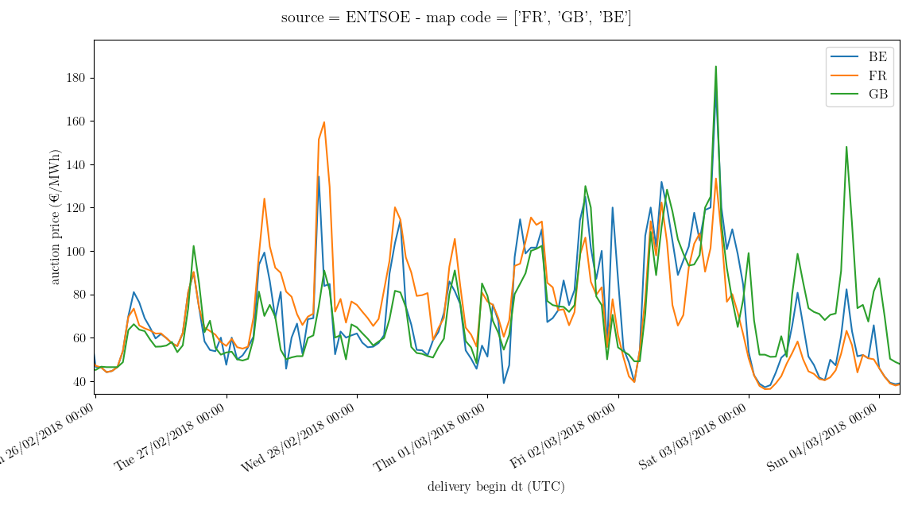
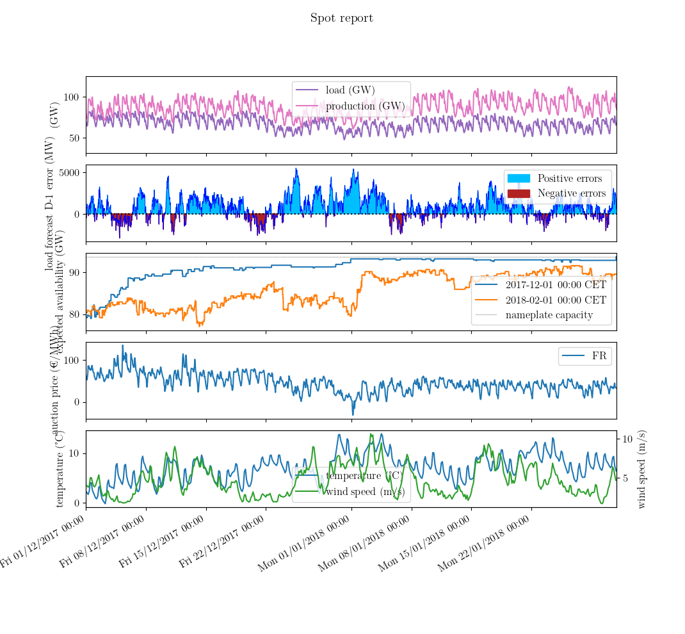

# Presentation
The objective of this repository is to share with an [MIT license](https://spdx.org/licenses/MIT.html) the visualization tools used with public data and developed by the Wholesale Markets Surveillance Directorate ([DSMG](https://www.cre.fr/en/CRE/organization)) of the Regulatory Commission of Energy ([CRE](https://www.cre.fr/en)). It can be used by final users such as developers and energy analysts.

To obtain the proposed interactive visualizations, the user should :
* install the package, 
* download the input data,
* run one of the scripts with ipython and her own choice of parameters.

All suggestions are welcome at <opensource@cre.fr>.

# Installation
It can be installed with :
```
cd ~/Downloads
git clone https://github.com/cre-os/energy-data-visualization.git
cd energy-data-visualization
conda create --name visu python=3.8 pip
conda activate visu
pip install -e .
```
The installation can then be tested with one of the following :
```
python scripts/weather/main_curve.py
```
or 
```
python scripts/load/main_forecasting_error.py
```
The scripts should terminate without any error.
They will create 3 folders in ~/ : 
- one for the raw data,
- one for the transformed data,
- one for the plots.

However, ipython should then be preferred for interactive plots.

# Download the input data
The data used for the visualizations proposed in this repository come from different public data sources.
only the data from eCO2mix and Météo-France are downloaded automatically.
Data from RTE and ENTSO-E should be downloaded manually.

## eCO2mix
Data about the supply and demand equilibrium and provided by Réseau de Transport d’Electricité ([RTE](https://www.rte-france.com/eco2mix/telecharger-les-indicateurs)) through [eCO2mix](https://www.rte-france.com/eco2mix/telecharger-les-indicateurs) allow to illustrate the production and the consumption on the French electricity network.
They **can be downloaded automatically**.
No account is necessary.

## ENTSO-E
The European Network of Transmission System Operators for Electricity ([ENTSO-E](https://www.entsoe.eu/)) publishes fundamental data on its [transparency platform](https://transparency.entsoe.eu/).
The source files used for the visualizations in this repository currently **have to be downloaded manually** with the [SFTP share](<https://transparency.entsoe.eu/content/static_content/Static content/knowledge base/SFTP-Transparency_Docs.html>).
An account is necessary.

## Météo-France
As the French national meteorological service, [Météo-France](http://meteofrance.com/) provides [observation data](https://donneespubliques.meteofrance.fr/?fond=produit&id_produit=90&id_rubrique=32) extracted from the Global Telecommunication System ([GTS](https://public.wmo.int/en/programmes/global-telecommunication-system)) of the World Meteorological Organization ([WMO](https://public.wmo.int/en/programmes/global-telecommunication-system)).
The data **can be downloaded automatically**.
No account is necessary.

## RTE
RTE publishes fundamental data about the French electricity transmission system.
The files currently **have to be downloaded manually** on the platform [RTE services portal](https://services-rte.com/en/download-data-published-by-rte.html).
An account is necessary.

## Local organization of the data
The data have to be stored as follows :

'''
~/_energy_public_data/
+-- 11_ENTSOE/
|  +-- ActualGenerationOutputPerUnit/
|  |  +-- 2014_12_ActualGenerationOutputPerUnit.csv
|  |  +-- …	 
|  +-- ActualTotalLoad/	 
|  |  +-- 2014_12_ActualTotalLoad.csv
|  |  +-- …	 
|  +-- DayAheadPrices/	 
|  |  +-- 2014_12_DayAheadPrices.csv
|  |  +-- …	 
|  +-- Outages/	 	 
|  |  +-- OutagesGU/	 
|  |  |  +-- 2014_12_OutagesGU.csv
|  |  |  +-- …
|  |  +-- OutagesPU/	 
|  |  |  +-- 2014_12_OutagesPU.csv
|  |  |  +-- …
+--20_MeteoFrance/	 	 
|  +-- synop/	 	 
|  |  +-- postesSynop.csv
|  |  +-- synop.201001.csv
|  |  +-- …	 
+--24_RTE/	 	 	 
|  +-- Centrales_production_reference/
|  |  +-- Centrales_production_reference.xls
|  +-- DonneesIndisponibilitesProduction/
|  |  +-- DonneesIndisponibilitesProduction_2010.xls
|  |  +-- …	 
|  +-- eCO2mix_RTE/	 
|  |  +-- eCO2mix_RTE_Annuel-Definitif_2012.xls
|  |  +-- …	 
|  +-- ProductionGroupe/	 
|  |  +-- ProductionGroupe_2012/
|  |  |  +-- ProductionGroupe_2012-semestre1.xls
|  |  |  +-- …
'''

# Description of the code
See the Sphinx documentation.

# How-to : ready-to-run examples
In this repository, we propose a set of modules that read, format, transform and plot the input data from different public sources.
We also provide ready-to-run visualization scripts as illustrated below.
The parameters therein can be modified by the user.

## Auctions

### Day-ahead fixing prices

This figure, that represents the fixing prices of the day-ahead auctions, is obtained by running <code> scripts/auctions/main_price.py <\code>.
The data, provided by ENTSO-E, currently have to be downloaded manually.


## Load

### National load

This figure is obtained by running <code> scripts/load/main_power.py <\code>.

### Day-ahead forecasting error

This figure represents the national load forecasting error and is obtained by running <code> scripts/load/main_forecasting_error.py <\code>.
The data are provided by eCO2mix.


## Outages

### Animated view of the unavailability

This figure is obtained by running <code> scripts/outages/main_animated_availability.py <\code>.
The data have to be downloaded manually from ENTSO-E or RTE platforms.

### Evolution of the mean unavailability

This figure is obtained by running <code> scripts/outages/main_evolution_mean_availability.py <\code>.
The data have to be downloaded manually from ENTSO-E or RTE platforms.

### Expected availability program of a given unit

This figure is obtained by running <code> scripts/outages/main_expected_program.py <\code>.
The data have to be downloaded manually from ENTSO-E or RTE platforms.

### Availability programs

This figure is obtained by running scripts/outages/main_incremental_programs.py.
The data have to be downloaded manually from ENTSO-E or RTE platforms.

### Regression delays

This figure is obtained by running scripts/outages/main_regression_delays.py.
The data have to be downloaded manually from ENTSO-E or RTE platforms.
It displays a linear fit between the initially announced and the finnaly observed length of the outages.
The coefficient being obtained with the minimization of a squared error, outliers have a large effect.


## Production data

## Unit production

This figure is obtained by running scripts/production/main_power.py.
It can be used with data provided by eCO2mix, ENTSO-E or RTE.


## Weather data

### National mean weather

This figure is obtained by running <code> scripts/weather/main_curve.py <\code>.
The data, provided from Météo-France, are downloaded automatically.

### Distribution of the temperature

This figure is obtained by running <code> scripts/weather/main_distribution.py <\code>.
The data, provided from Météo-France, are downloaded automatically.


## Multiplots

### Spot report

This figure is obtained by running scripts/multiplots/main_spot_report.py.
As it mixes data from different sources, the data from ENTSO-E and RTE have to be downloaded manually.

### Announced availability and observed production of a given unit

This figure is obtained by running scripts/multiplots/main_transparent_production.py.
The data from RTE have to be downloaded manually.


# Parameters of the scripts

| Variable name                  | Type                            | Possible values                                                 | Purpose                                       |
| ---                            | ---                             | ---                                                             | ---                                           |
| close                          | bool                            | True; False	                                             | Close the figure after saving                 |
| company_outages                | None or string                  | any company that publishes                                      | -                                             |
| contract_delivery_begin_year   | int                             | 2018; …                                                         | -                                             |
| contract_delivery_period_index | int	                           | depends on the selected contract_product                        | -                                             |
| contract_product               | string	                   | "M"; "Q"; …	                                             | -                                             |
| contract_profile               | string	                   | "BASE"; "PEAK" …                                                | -                                             |
| data_source_auctions           | string	                   | "ENTSOE"                                                        | -                                             |
| data_source_load               | string	                   | "eCO2mix"; "ENTSOE"                                             | -                                             |
| data_source_outages            | string                          | "ENTSOE"; "RTE"                                                 | -                                             |
| data_source_production         | string                          | "eCO2mix"; "ENTSOE"; "RTE"                                      | -                                             |
| data_source_weather            | string                          | "MétéoFrance"                                                   | -                                             |
| date_max                       | None or string                  | localized pd.Timestamp                                          | Right xlim of the plot                        |
| date_min                       | None or string                  | localized pd.Timestamp                                          | Left xlim of the plot                         |
| diff_init                      | bool                            | True; False                                                     | Plot the differences between pairs of dates   |
| figsize                        | (int,int)                       | (8,6)                                                           | Figure size                                   |
| folder_out                     | path                            | global_var.path_plots                                           | Plots output                                  |
| load_nature                    | string                          | "load forecast D-1 (GW)";"load forecast D-0 (GW)"; "load (GW)"  | -                                             |
| map_code                       | string                          | "FR"; …                                                         | -                                             |
| map_code_auctions              | list of strings                 | ["FR", "GB", "BE"…]                                             | -                                             |
| production_nature              | string                          | "production (GW)"                                               | -                                             |
| production_source              | None or string                  | "biomass"; "solar"; …                                           | -                                             |
| publication_dt_extrapolate     | list of localized pd.Timestamp  | -                                                               | Availability plotted as seen from these dates |
| publication_dt_max             | None or localized pd.Timestamp  | -                                                               | -                                             |
| publication_dt_min             | None or localized pd.Timestamp  | -                                                               | -                                             |
| smoother                       | string or pd.Timedelta          | "basic";                                                        | For aesthetic purposes                        |
| unit_name                      | None or string                  | any production unit                                             | -                                             |
| weather_nature                 | string                          | "observation"                                                   | -                                             |
| weather_quantity               | string                          | "nebulosity (%)"; '"temperature (°C)"; "wind_speed m/s)"        | -                                             |


